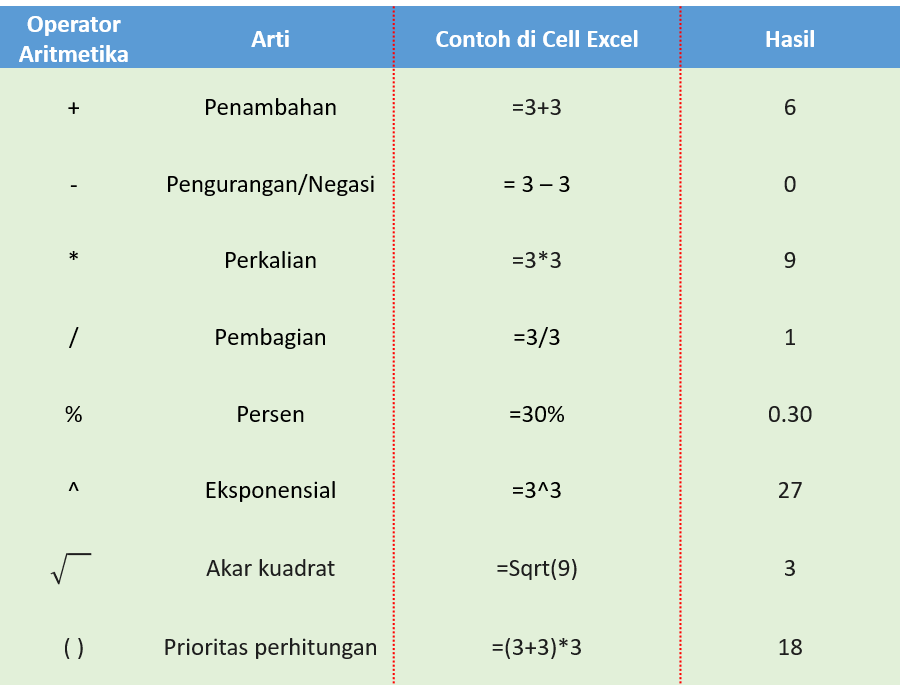
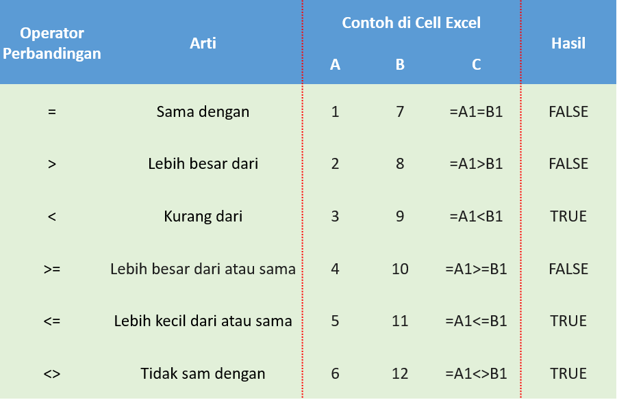
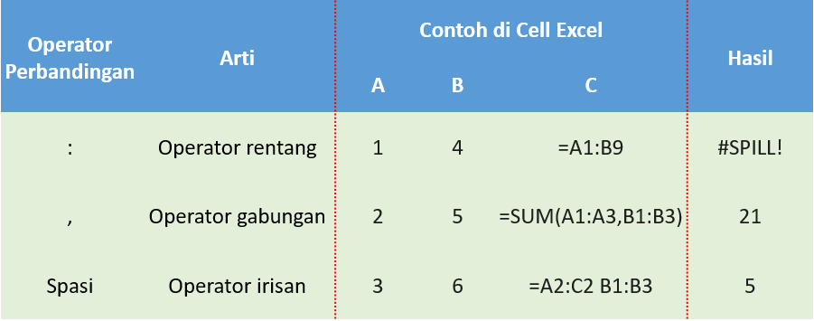
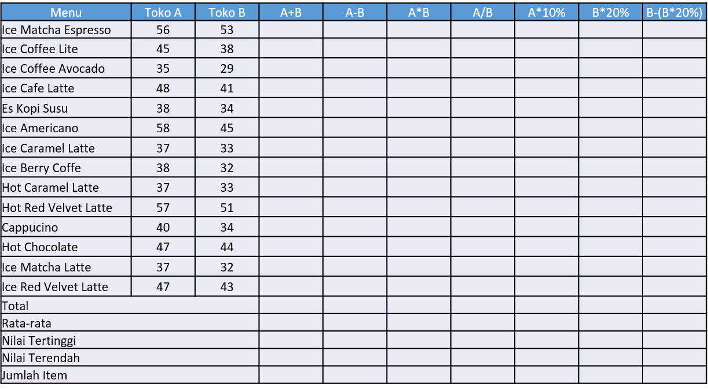
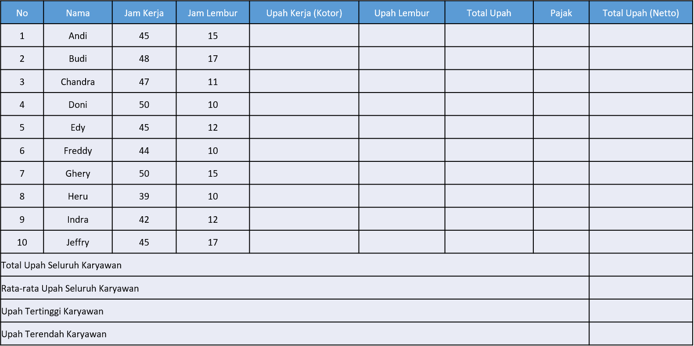
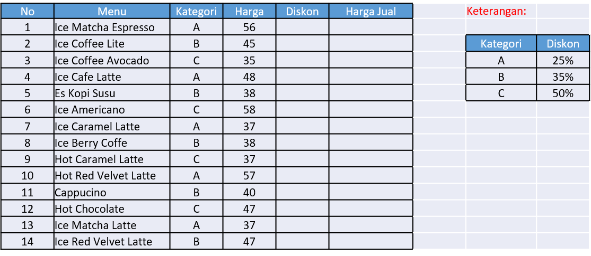
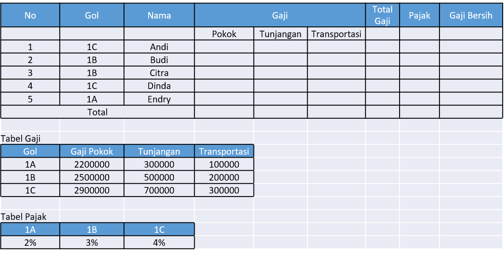
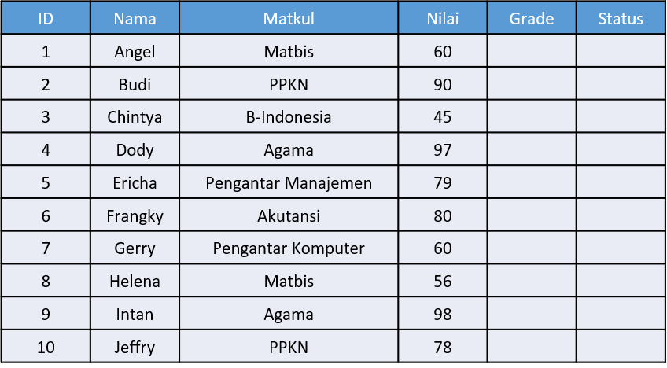

# Dasar Matematika Bisnis {#Dasar-Matematika-Bisnis} 
*** 

Kemana anda bisa pergi dalam hidup dan tidak mengenal angka dan matematika? Bahkan saat anda sedang mencari tahu harga suatu produk (termasuk pengiriman) di Lazada, Tokopedia, Traveloka, dll, termasuk saat mengatur pemasukan dan pengeluaran di rekening bank anda, dalam hal ini menggunakan keterampilan matematika dasar dari pendidikan dasar dan menengah. Berikut ini adalah beberapa contoh sederhana mengenai penerapan matematika yang anda lakukan setiap hari:

* Di toko bahan makanan, anda seringkali membandingkan produk untuk menghitung nilai terbaik. Satu merek keripik kentang dijual seharga $\$ 3,99$ untuk 300 g, sedangkan merek yang sama memuaskannya di sampingnya seharga $\$ 3,49$ untuk 250 g. Mana yang menawarkan nilai lebih baik?
* Jika anda adalah penggemar olahraga, anda tahu banyak statistik tentang pemain dan tim favorit anda. Banyak yang datang dalam bentuk persentase, seperti lemparan tiga poin untuk bintang NBA atau menyimpan persentase untuk penjaga gawang NHL. Apa sebenarnya arti persentase tersebut?
* Banyak majikan membayar bonus. Mungkin di perusahaan anda, manajer mendapatkan bonus dua kali lebih besar daripada karyawan. Perusahaan anda memiliki lima manajer dan 25 karyawan. Jika mengumumkan bonus total $\$ 35.000,$ berapa bagian anda sebagai karyawan?

Sadar atau tidak Matematika dan angka mengelilingi anda di dunia bisnis, termasuk saat anda harus membaca banyak laporan numerik, menafsirkan bagaimana angka-angka itu cocok, dan membuat laporan anda sendiri yang menunjukkan metrik seperti proyeksi penjualan dan laba. Diluar pekerjaan, anda juga harus mengelola pendapatan dan membayar tagihan anda. Ini adalah masalah matematika yang mungkin anda pecahkan setiap hari, memastikan bahwa uang yang mengalir keluar dari rekening bank anda tidak melebihi uang yang mengalir masuk. Untuk membeli bahan makanan, liburan, atau hiburan, dalam hal ini ada perlu untuk mempertimbangkan prioritas utama.

Bab ini mengulas tentang keterampilan matematika dasar yang menjadi acuan penting di bab-bab selanjutnya. Beberapa contoh akan dijelaskan secara rinci, sementara yang lain akan diseerahkan kepada anda untuk menyelesaikan bab ini secara mandiri. Bagaimanapun, bab ini penting dan harus digunakan untuk menguji kemampuan dasar anda. Olehkarena itu, pelajarilah bab ini dengan percaya diri, dan jika anda menemui kesulitan, pastikan anda menguasai konsep sebelum melanjutkan ke bab berikutnya.


## Urutan Perhitungan

Andaikan baru saja anda memenangkan $\$ 50.000$ dalam sebuah undian, Yeah... Selamat untuk Anda! Tetapi sebelum dapat mengklaimnya, anda diminta untuk menjawab pertanyaan pengujian keterampilan matematika, dan tidak ada kalkulator yang diizinkan. Setelah anda menyerahkan tiket kemenangan ke agen penukaran, dia memberikan pertanyaan pengujian keterampilan terbatas waktu: 2 × 5 + 30 ÷ 5. Saat waktu dihitung mundur, anda pasti mempertimbangkan berbagai kemungkinan. Apakah jawabannya 8, 14, 16, atau sama sekali berbeda? Bukankah sangat buruk kehilangan $ 50.000 karena anda tidak dapat menjawab pertanyaan itu! Jika anda menemukan solusinya adalah 16, anda berada di jalan yang benar. Sebaliknya jika anda memperoleh jawaban berbeda, inilah saat yang tepat untuk meninjau ulang cara anda melakukan perhitungan. 

Dalam buku ini akan diperkenalkan operasi perhitungan matematika dengan menggunakan EXcel yang mungkin saja memiliki kesamaan dengan beberapa Kalkulator atau Applikasi. Operator yang anda gunakan dalam Excel adalah factor yang paling krusial saat melakukan penghitungan yang ingin Anda lakukan pada elemen suatu rumus. Excel mengikuti aturan matematika umum untuk penghitungan, yaitu Tanda Kurung (Parentheses), Eksponen (Exponents), Perkalian dan Pembagian (Multiplication and Division), serta Penambahan dan Pengurangan (Addition and Subtraction). Perlu dicatat bahwa penggunaan tanda kurung memungkinkan anda mengubah urutan penghitungan tersebut. 


## Operator Aritmetika 

Untuk melakukan operasi matematika dasar, seperti penambahan, pengurangan, perkalian, atau pembagian; menggabungkan angka; dan menghasilkan nilai numerik, anda dapat menggunakan operator aritmetika berikut ini dalam Excel.

```{r aritmatika, echo=FALSE,fig.align='center', fig.cap="Operator Aritmetika", out.width = '75%'}

```

**Catatan:** () atau [] atau {} Secara berurutan, ini dikenal sebagai tanda kurung bulat, persegi, dan keriting.

## Operator Perbandingan 

Saat dua nilai dibandingkan dengan menggunakan operator ini, hasilnya adalah nilai logika—TRUE atau FALSE. Anda juga dapat membandingkan dua nilai dengan operator berikut dalam Excel. 

```{r perbandingan, echo=FALSE,fig.align='center', fig.cap="Operator Perbandingan", out.width = '75%'}

```

## Operator Referensi 

Pada bagian ini ada diharapakan untuk dapat menggunakan penggabungan rentang sel untuk perhitungan dengan operator dalam Excel.

```{r referensi, echo=FALSE,fig.align='center', fig.cap="Operator Referensi", out.width = '75%'}

```
**Catatan:** Kesalahan #SPILL dikembalikan saat rumus mengembalikan beberapa hasil, dan Excel tidak bisa mengembalikan hasil ke Cell. Operator rentang `:` ini tidak dapat berdiri sendiri.


## Dasar Persamaan Linear

Sebagai contoh ada dua persamaan linier yaitu 

* $Y_1 = 10 -2X$ dan 
* $Y_2 = 2 + 2X$ , 

maka sistem persamaan linier tersebut adalah

**Langkah pertama**, mencari nilai $X:$

* Y_1=Y_2
* 10-2X=2+2X
* 10-2x-2-2X=0
* 8 = 4X
* X = 8/4=2

**Langkah 2**, mencari Nilai $Y,$

diktehui nilai pertemuan pada $X=2$, maka dimasukan dalam persamaan pertama yaitu

* Y_1= 10-2X
* Y_1=10-2.2 = 6

Jadi nilai persamaan 1 dan 2 adalah $x=2$ dan $y=6$ atau pada koordinat (2,6). Jadi kesimpulanya adalah Tujuan dari sietem persamaan Linier adalah mencari nilai pertemuan antara dua persamaan garis lurus, yang dapat dicari gengan menggunakan metode Substitusi dan metode eliminasi.

Contoh juga juga dapat diselesaikan dengan menggunakan Excel. persamaan diatas dapat kita sederhanakan menjadi sistem persamaan linear berikut ini:

* $2x + y = 10$
* $-2x +y = 2$

Dalam notasi matriks, ini dapat ditulis sebagai $AX = B$

\[ A=
\begin{bmatrix}
    2 & 1 &  \\
   -2 & 1 
\end{bmatrix}, 
\begin{bmatrix}
    x  \\
   y 
\end{bmatrix},
\begin{bmatrix}
    10  \\
   2 
\end{bmatrix}
\]


Jika A-1 (kebalikan dari A) ada, kita dapat mengalikan kedua sisi dengan A-1 untuk mendapatkan X = A-1B. Untuk mengatasi sistem persamaan linear dengan Microsoft Excel, jalankan langkah-langkah yang terlampir pada [file Exel ini](). 


## Latihan 1 

### Kasus 1.1 {-}
Andaikan diketahui harga menu Kopi Dari Hati di Toko A dan Toko B secara berturut-turut pada cell A dan B yang terlampir pada gambar \@ref(fig:tabel1), lakukan evaluasi operasi matematika dasar untuk melengkapi laporan tersebut. 


```{r tabel1, echo=FALSE,fig.align='center', fig.cap="Harga Menu Toko A dan B", out.width = '80%'}

```

### Kasus 1.2 {-}

Diberikan daftar Karyawan PT. Kopi Dari Hati ~ Cabang Tangerang, September 2020, pada gambar \@ref(fig:tabel2). Pada bagian ini digunakan fungsi seperti SUM, MIN, AVERAGE, dan MAX.

```{r tabel2, echo=FALSE,fig.align='center', fig.cap="Daftar Karyawan", out.width = '80%'}

```

**Keterangan:**

* Upah Kerja (Kotor) = Jam Kerja x 25000
* Upah Lembur = Jam Lembur x 30000
* Total Upah = Upah Kerja + Upah Lembur
* Pajak = Total Upah x 5%
* Total Upah (Netto) = Total Upah – Pajak

### Kasus 1.3 {-}

Pada bagian ini anda diharapkan untuk mampu menerapkan Fungsi VLOOKUP untuk mengitung Harga Penjualan Kopi Dari Hati, lihat gambar \@ref(fig:tabel3).

```{r tabel3, echo=FALSE,fig.align='center', fig.cap="Harga Penjualan Kopi Dari Hati", out.width = '80%'}

```
**Catatan:**

Vlookup merupakan fasilitas dari Microsoft Excel yakni mengambil data yang ada di tabel lain (tabel Array) berdasarkan data yang sesuai dengan tabel. Selain Vlookup ada juga Hlookup, perbedaannya adalah VLOOKUP digunakan untuk tabel secara Vertikal sedangkan HLOOKUP yaitu pemanggilan tabel array secara Horizontal.


### Kasus 1.4 {-}

Pada bagian ini anda diharapkan untuk mampu menerapkan Kombinasi Fungsi VLOOKUP dan HLOOKUP untuk Mengitung Daftar Gaji Karyawan Kopi Dari Hati, lihat gambar \@ref(fig:tabel4).

```{r tabel4, echo=FALSE,fig.align='center', fig.cap="Gaji Karyawan Kopi Dari Hati", out.width = '80%'}

```

**Keterangan:** 

* Untuk gaji sesuai dengan gologan berdasarkan tabel gaji
* Total Gaji =Gaji Pokok+Tunjangan+Transportasi
* Pajak=Total Gaji x Pajak
* Gaji Bersih= Total Gaji – Pajak

### Kasus 1.5 {-}

Pada bagian ini anda diharapkan untuk mampu menerapkan Fungsi IF Tunggal dan IF Majemuk untuk melengkapi Daftar Mahasiswa/i Manajemen Universitas Matana 2020 pada gambar \@ref(fig:tabel5).

```{r tabel5, echo=FALSE,fig.align='center', fig.cap="Daftar Mahasiswa/i", out.width = '80%'}

```

**Keterangan:**

* Grade  : 

  * Grade A for Marks 90 – 100, 
  * Grade B for marks 80 – 89, 
  * Grade C for marks 70 – 79, 
  * Grade D for marks 60 – 69, 
  * Grade E for < 60
  
* Status : 
  * if grade  75 is Complete, 
  * if grade < 75 is Failed
  
  
### Kasus 1.6 {-} 


Selesaikan sistem persamaan linear dengan menggunakan Excel. 


